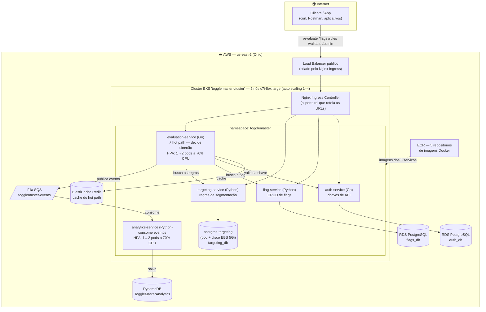

# Arquitetura do ToggleMaster — Tech Challenge Fase 2 (FIAP POSTECH)

> **Para quem está chegando agora:** este documento explica como o ToggleMaster funciona
> na nuvem, primeiro em linguagem simples e depois com os detalhes técnicos.
> As dificuldades que enfrentamos (e como resolvemos) estão no final.

---

## 1. O que é o ToggleMaster? (explicação para leigos)

O ToggleMaster é um sistema de **feature flags** — "interruptores de funcionalidades".

Imagine que uma empresa quer lançar um botão novo no aplicativo, mas só para 10% dos
usuários, para testar antes de liberar para todo mundo. Em vez de reescrever o app a cada
mudança, o app **pergunta ao ToggleMaster**: *"para este usuário, o botão novo está ligado?"*
— e o ToggleMaster responde **sim ou não** em milissegundos.

Na Fase 1, isso era um sistema único (um "monolito"). Nesta Fase 2, ele foi dividido em
**5 mini-sistemas independentes (microsserviços)**, cada um com uma única responsabilidade,
rodando em **Kubernetes na nuvem da AWS** — a mesma tecnologia usada por grandes empresas
para ter escala e resiliência.

## 2. Os 5 microsserviços

| Serviço | Linguagem | O que faz (em palavras simples) | Onde guarda os dados |
|---|---|---|---|
| **auth-service** | Go | O "porteiro": cria e valida as chaves de acesso (API keys) | PostgreSQL (RDS `auth_db`) |
| **flag-service** | Python | O "cadastro": cria, edita e lista as flags | PostgreSQL (RDS `flags_db`) |
| **targeting-service** | Python | O "estrategista": regras de quem vê o quê (ex.: só 10% dos usuários) | PostgreSQL (pod `targeting_db`) |
| **evaluation-service** | Go | O "atendente rápido" (hot path): responde sim/não para cada pergunta | Cache Redis (ElastiCache) |
| **analytics-service** | Python | O "contador": registra cada avaliação feita, para estatísticas | Fila SQS → DynamoDB |

## 3. Diagrama da arquitetura na AWS

**Como ler o diagrama:** o cliente chama uma URL pública; o Load Balancer entrega ao
Nginx Ingress, que olha o caminho (`/evaluate`, `/flags`...) e encaminha ao serviço certo.
O caminho quente (setas do evaluation) é otimizado: cache Redis para responder rápido e
fila SQS para registrar eventos **sem atrasar a resposta** — o analytics processa depois,
no seu próprio ritmo.

## 4. As decisões de arquitetura (e os porquês)

> Registro completo (formato ADR) em [`00_COLAB_IA/DECISOES.md`](../00_COLAB_IA/DECISOES.md).

| # | Decisão | Por quê (em palavras simples) |
|---|---|---|
| D-001 | O banco do targeting roda como **pod** no cluster (não no RDS) | O plano gratuito da AWS só permite **2 bancos RDS** — e precisávamos de 3. Rodar o terceiro dentro do cluster (com disco EBS para não perder dados) resolve sem custo extra. **Aprovado pelo professor.** |
| D-002 | Conta pessoal da AWS (não o AWS Academy) | O Academy usa credenciais que expiram a cada ~4h (quebrariam a demo no meio) e é travado em outras regiões. |
| D-003 | Região **us-east-2 (Ohio)** | Padronização: toda a infra num lugar só evita erros de "recurso não encontrado". |
| D-004 | Redis/fila/NoSQL como serviços **gerenciados** (ElastiCache, SQS, DynamoDB) | SQS e DynamoDB não custam nada parados; menos coisas para operar dentro do cluster. |
| D-005 | Pasta de contexto `00_COLAB_IA/` versionada no Git | O repo é privado; código e contexto viajam juntos entre as 2 máquinas do grupo. |
| D-006 | Entrega mínima: 1 réplica por serviço, HPA só onde o PDF exige | O PDF pede HPA no evaluation e no analytics — entregamos exatamente isso, simples e bem feito. |
| D-007 | Nós **c7i-flex.large** (não t3.medium) | O plano gratuito **bloqueou** a t3.medium na hora de criar as máquinas; a c7i-flex.large é equivalente (2 vCPU / 4 GB) e é permitida. |

## 5. Escalabilidade (como o sistema cresce sozinho)

- **Nível dos pods (HPA):** o `evaluation-service` e o `analytics-service` têm um
  Horizontal Pod Autoscaler: se a CPU média passa de **70%**, o Kubernetes cria um
  segundo pod automaticamente (1→2); quando a carga passa, volta a 1.
- **Nível das máquinas (node group):** o grupo de nós tem auto scaling
  Min 1 / Desejado 2 / Máx 4 — há espaço para os pods extras nascerem.
- **Por que HPA por CPU no analytics (e não KEDA)?** Quando a fila SQS enche, o worker
  processa mais mensagens, a CPU sobe e o HPA escala — atende o requisito do desafio.
  O KEDA (escala olhando o tamanho da fila) era **opcional** no PDF e foi pulado de
  propósito para manter a entrega simples.

## 6. Os 3 tipos de armazenamento (e por que 3?)

| Armazenamento | Analogia | Uso no projeto |
|---|---|---|
| **RDS (PostgreSQL)** | Arquivo de aço: organizado, confiável, relacional | Chaves de API e definições das flags — dados que não podem se perder e têm estrutura fixa |
| **ElastiCache (Redis)** | Post-it na mesa: acesso instantâneo | Cache do hot path — a resposta sim/não já pronta, sem ir ao banco a cada pergunta |
| **DynamoDB (NoSQL)** | Esteira de caixa de mercado: registra alto volume sem parar | Eventos de analytics — milhares de registros por minuto, sem esquema rígido |

## 7. Dificuldades encontradas (e como resolvemos)

> Esta seção é o "diário de guerra" do projeto — o PDF pede que os desafios sejam
> explicados no vídeo, e aqui está o registro completo.

1. **Limite de 2 RDS no plano gratuito.** Precisávamos de 3 bancos PostgreSQL e a AWS
   recusou a 3ª instância. **Solução:** o banco do targeting virou um pod PostgreSQL
   dentro do cluster, com disco EBS persistente (StatefulSet). Aprovado pelo professor.

2. **Plano gratuito bloqueou a máquina t3.medium.** Ao criar o node group, a AWS
   recusou: "not eligible for Free Tier" — o plano gratuito novo só deixa lançar
   instâncias da lista dele. **Solução:** c7i-flex.large (equivalente e permitida).

3. **Usuário de deploy sem acesso ao EKS.** O usuário IAM `togglemaster-deploy` não
   enxergava o cluster (nem o `kubectl` conectava). **Solução:** política `eks:*` +
   *access entry* de administrador no cluster.

4. **Disco do banco targeting "preso" (Pending).** O cluster tinha a StorageClass `gp2`,
   mas ela não estava marcada como padrão — o pedido de disco ficava eternamente
   pendente. **Solução:** marcar a `gp2` como default e recriar o volume.

5. **Firewall do RDS sem a porta do PostgreSQL.** Um dos security groups não liberava
   a porta 5432 — os serviços não alcançariam os bancos. **Solução:** regra de entrada
   5432 liberada para a rede interna do VPC (10.0.0.0/16).

6. **Tabelas não existiam nos RDS.** Os bancos existiam, mas vazios (o erro
   `relation "api_keys" does not exist` apareceu no primeiro uso). **Solução:** executar
   os `init.sql` do auth e do flags de dentro do cluster, usando o `psql` do pod
   postgres-targeting.

7. **Ovo-e-galinha da SERVICE_API_KEY.** O evaluation precisa de uma chave criada pelo
   auth-service — que ainda não estava no ar. **Solução:** deploy com valor provisório,
   criação da chave real via `POST /admin/keys` e atualização do secret em seguida.

8. **Script quebrado pelo Windows (CRLF).** No ambiente local, o script que cria o
   `targeting_db` falhava com `/bin/sh^M: bad interpreter` — o Git no Windows tinha
   convertido as quebras de linha, corrompendo o script dentro do contêiner Linux.
   **Solução:** converter para LF e fixar `*.sh` / `*.sql` como LF no `.gitattributes`.

9. **Região trocada nos manifestos (histórico).** Manifestos antigos apontavam para
   us-east-1 enquanto a infra estava em us-east-2. **Solução:** padronização geral em
   us-east-2 (D-003).

## 8. Endereços e nomes de referência

| Recurso | Valor |
|---|---|
| Load Balancer público | `a4e86e3f9b5564375bcbe8c46ad4acee-fc7302f5c0e6e08e.elb.us-east-2.amazonaws.com` |
| Cluster EKS | `togglemaster-cluster` (K8s, us-east-2) |
| RDS | `togglemaster-auth` e `togglemaster-flags` |
| ElastiCache | `togglemaster-redis` |
| Fila SQS | `togglemaster-events` |
| Tabela DynamoDB | `ToggleMasterAnalytics` |
| Rotas do Ingress | `/evaluate` `/flags` `/rules` `/validate` `/admin` |

> ⚠️ **Custo:** o node group (2 nós) e o Load Balancer custam ~US$ 0,19/h ligados.
> A regra do projeto é ligar para demonstrar e derrubar depois — RDS, SQS, DynamoDB e
> ElastiCache podem ficar (grátis ou quase grátis parados).
